# College 360

Flutter Project Created for AICTE organisation during National Finale of Smart India Hackathon.

# INSTALLATION GUIDE

 1) Clone this repo
 2) Setup environment for flutter development
 3) Install Android Studio 
 4) Configure all packages mentioned in pubspec.yaml
 5) Create a firebase new project and download google service json file and add your file in local cloned project
 6) Now you are ready to run the app

# Take Virtual Tours and explore colleges Geo-tagged (pinned) on google map.

Discover colleges with ease by taking virtual tours and exploring their campuses, all conveniently geotagged (pinned) on Google Maps. Get a firsthand look at different educational institutions and their facilities from the comfort of your own device. 

## Features

- 360° virtual tour of colleges with information available
- multilingual support
- Geotagging of institutes on Gmap
- Chat forum
- College updates 

## Gmap

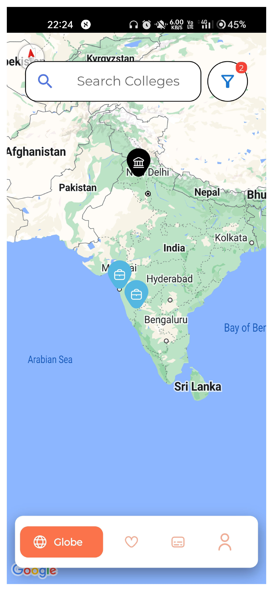
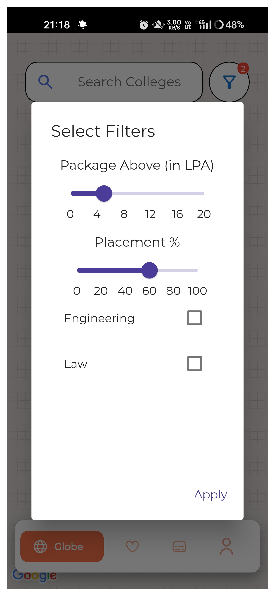
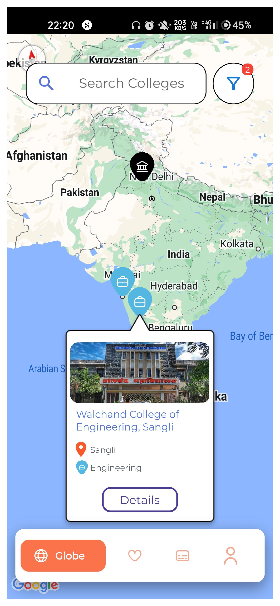

## College Home Page

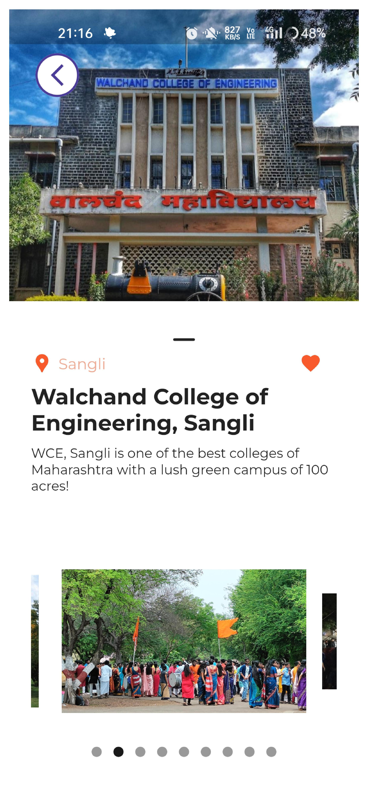

## Select Tour

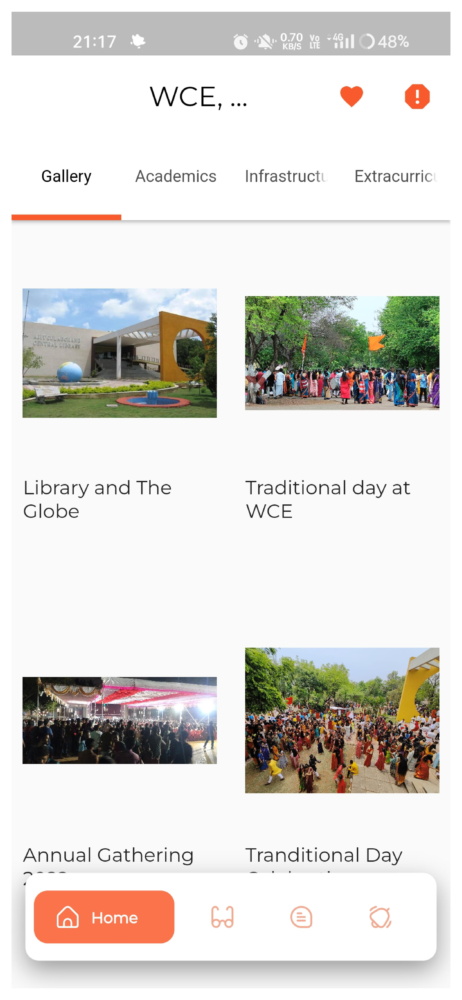
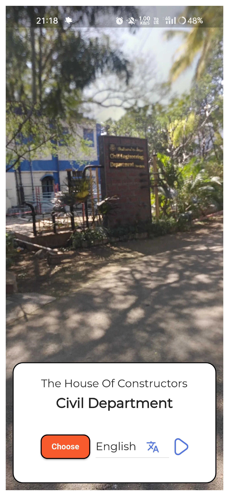

## Chat and Update Forum

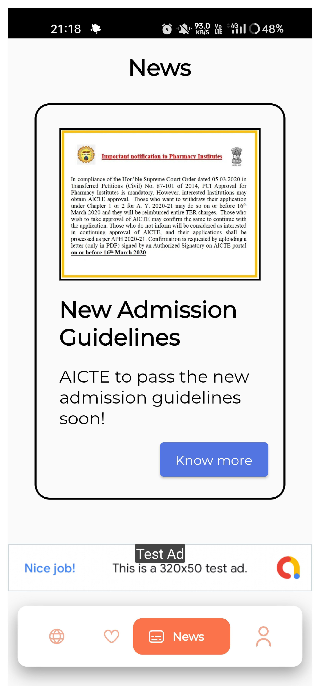
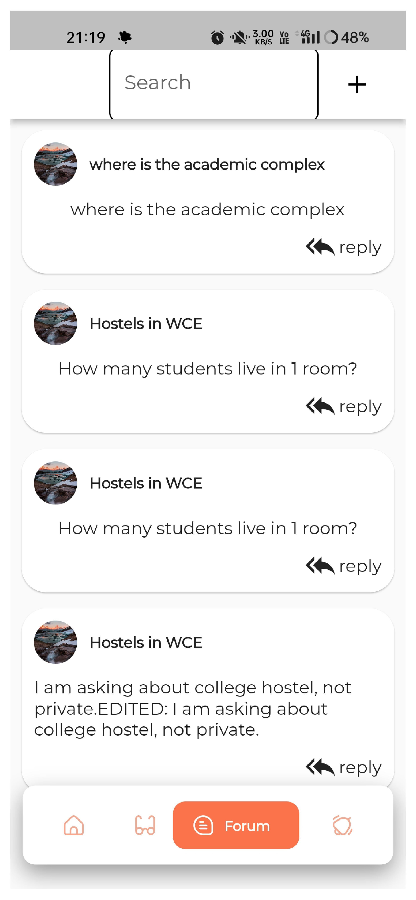
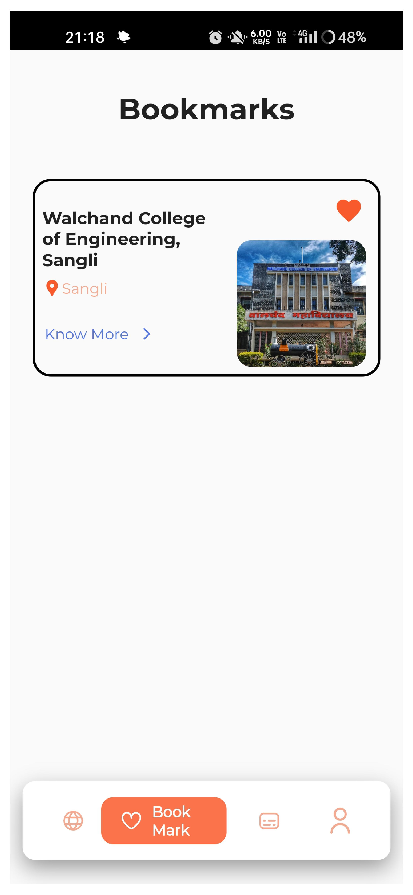
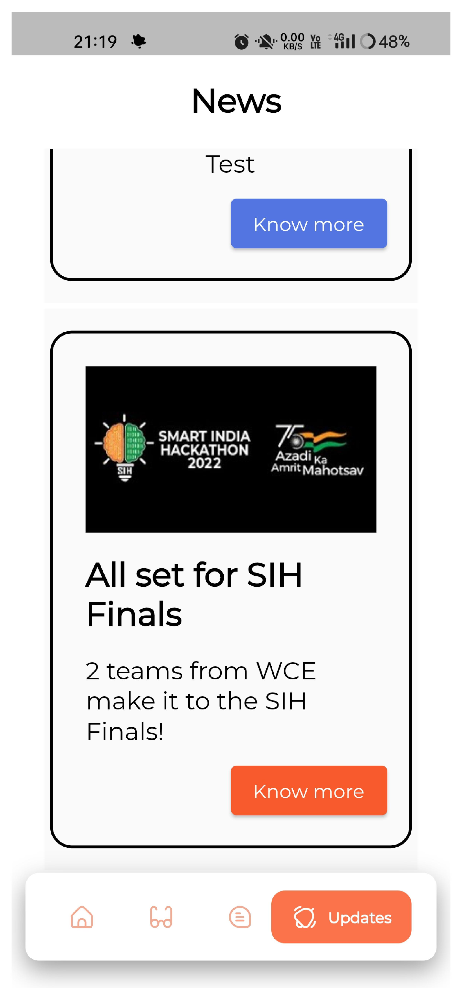

## Profile Screens

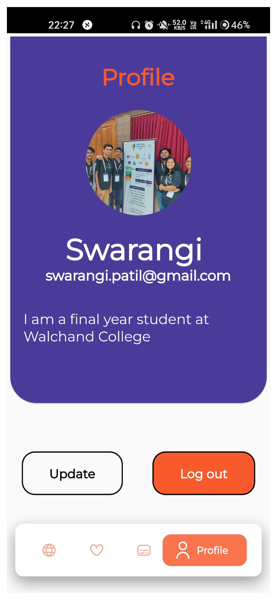

## SMART INDIA HACKATHON

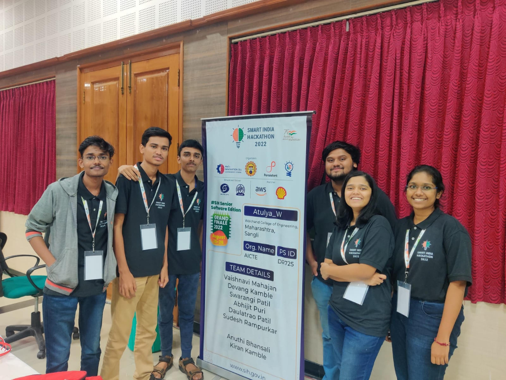
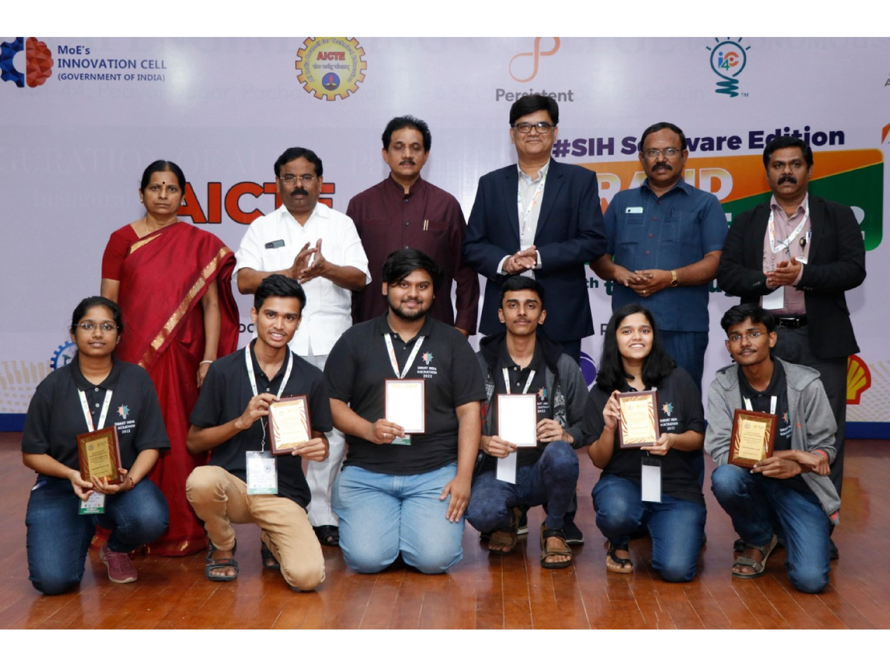

